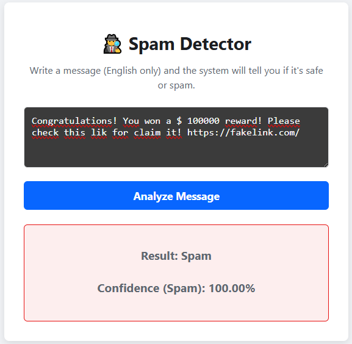
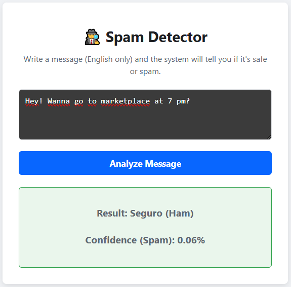

# 🛡️ ShieldText - AI Spam Detector


**ShieldText** is a smart web application capable of detecting SPAM text messages (SMS) using Machine Learning. The model has been trained on a dataset of thousands of real messages to distinguish between safe content ("ham") and junk mail ("spam").

## Features

- **Real-Time Detection:** Instant analysis of text messages.
- **Confidence Probability:** Displays how certain the model is about its prediction.
- **Modern Architecture:** React (Vite) frontend and Python (Flask) backend.
- **NLP Model:** Utilizes Natural Language Processing (Bag of Words + Naive Bayes).

## 📸 Screenshots







## Tech Stack

### Backend (AI & API)
- **Python**: Core programming language.
- **Scikit-Learn**: Used for model training (Multinomial Naive Bayes).
- **Flask**: To expose the model as a REST API.
- **Pandas**: Data manipulation and cleaning.

### Frontend (UI)
- **React + Vite**: For a fast and reactive user interface.
- **CSS3**: Custom styles and responsive design.
- **Axios**: For backend communication.

## Local Installation and Usage

1. **Clone the repository**
   ```bash
   git clone [https://github.com/PedroDelgado4/shieldtext.git](https://github.com/PedroDelgado4/shieldtext.git)
   cd shieldtext
